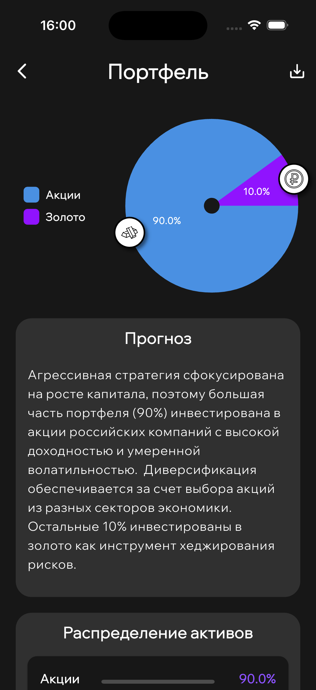
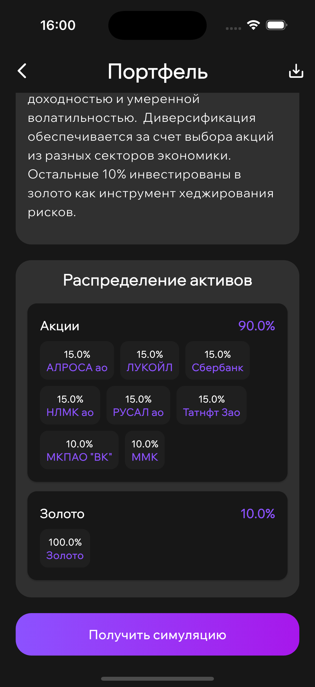

# Investify

Investify is a Flutter application for managing and generating investment portfolios.

## Features

- Required user authentication
- Portfolio management (in future updates)
- Investment tracking
- Data visualization

## Server deploying
❤️ Thanks to [Niki](https://github.com/nikameru) for this

Clonning repository
```
git clone https://github.com/team-x4lva/investify-backend.git
```
Deploying
```
docker compose up --build
```

## Dependencies

The project uses the following dependencies:

- `flutter_bloc`
- `dio`
- `isar`
- `flutter_secure_storage`

## Screenshots


| Sign Up | Sign In| 
|:-------------:|:------------------:|
|  |  |

| Home Screen | Configurate Screen| 
|:-------------:|:------------------:|
|  |  |


| Portfolio Screen | Simulation Screen (Part)| 
|:-------------:|:------------------:|
|   |  |


## License

This project is licensed under the MIT License - see the LICENSE file for details.